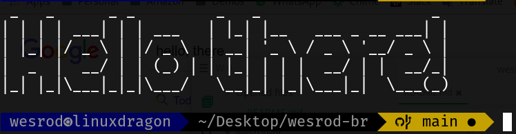

# 

I am **Wesley Rodrigues**, and this is my repository for working and researching.

## Tech Domains and Experience

| Domain                 | proficiency                    | years of experience |
| ---------------------- | ------------------------------ | ------------------- |
| Systems Administration | :star::star::star::star::star: | +14                 |
| Linux Administration   | :star::star::star::star::star: | +14                 |
| Shell Script           | :star::star::star::star::star: | +14                 |
| Networking             | :star::star::star::star:       | +10                 |
| Cloud Computing        | :star::star::star::star:       | +8                  |
| IT Security            | :star::star::star::star:       | +8                  |
| Ethical Hacking        | :star::star::star::star:       | +6                  |
| Data Science           | :star::star::star::star:       | 4                   |
| AI/ML                  | :star::star::star::star:       | +8                  |
| DevOps                 | :star::star::star::star:       | 6                   |
| Web Development        | :star::star::star::star:       | +10                 |
| Mobile Development     | :star::star::star:             | 6                   |
| Presentation           | :star::star::star::star:       | +10                 |

## Programing Languages

## Research Areas

### BioHacking and Transhumanism

Body hacking is the application of the hacker ethic to improve their own bodies with do it yourself cybernetic devices or introducing Biochemicals into the body to enhance or change their bodies' functionality. It is also known as biohacking, although this term also has other meanings. People engaged in this activity are called grinders. Many grinders identify with the biopunk movement, open-source transhumanism, and techno-progressivism. The Grinder movement is strongly associated with the body modification movement and practices actual implantation of cybernetic devices in organic bodies as a method of working towards transhumanism, such as designing and installing do-it-yourself body-enhancements such as magnetic implants. Biohacking emerged in a growing trend of non-institutional science and technology development.

According to Biohack.me, "Grinders are passionate individuals who believe the tools and knowledge of science belong to everyone. Grinders practice functional extreme body modification in an effort to improve the human condition. Grinders hack themselves with electronic hardware to extend and improve human capacities. Grinders believe in action, their bodies the experiment."

"Biohacking" can also refer to managing one's own biology using a combination of medical, nutritional and electronic techniques. This may include the use of nootropics, non-toxic substances, and/or cybernetic devices for recording biometric data (as in the Quantified Self movement).

**Popular usage**

- Neural implant
- Neuroprosthetics (also called neural prosthetics)
- Subdermal implants
- Microchip implant
- Magnetic implant

(text from Wikipedia)

### BioInspired Architectures

Bio-inspired computing, short for biologically inspired computing, is a field of study which seeks to solve computer science problems using models of biology. It relates to connectionism, social behavior, and emergence. Within computer science, bio-inspired computing relates to artificial intelligence and machine learning. Bio-inspired computing is a major subset of natural computation.

Brain-inspired computing refers to computational models and methods that are mainly based on the mechanism of the brain, rather than completely imitating the brain. The goal is to enable the machine to realize various cognitive abilities and coordination mechanisms of human beings in a brain-inspired manner, and finally achieve or exceed Human intelligence level.

(text from Wikipedia)

### Data Science for Economy

Economic data science is about decoding and managing the digital transformation. The interplay between new technologies and human behaviour, both at the individual and the collective level, produces complex feedback loops that offer tremendous socio-economic opportunities but at the same time expose society to unprecedented potential risks.

New kinds of data, behavioural and ecological in the broadest sense, allow us to measure economic activity – outputs, employment, wages, spending, mobility, trade – faster, more precisely and at a more dis-aggregated level than it has previously been possible. This means that individual, business and government decisions can be based on a much more complete and up-to-date picture of what is going on in the economy.

New data also allow us to tackle the full complexity of the socio-technical systems we create and inhabit, and require new methods to support traditional approaches. The interdisciplinary approach in this theme combines machine learning and AI with concepts and tools developed in complex systems science and network science.

**Aims**

Deploy machine learning and AI techniques to new and existing datasets to decode the digital transformation and support individual, business and government decisions.
Promote an interdisciplinary approach to the study of the economy, where complex systems science and network science support traditional approaches.
Address society and the economy as complex adaptive systems – i.e. recognising that feedback loops, 'crises’, and second-order effects are not accidents but rather fundamental properties of the system itself.
Propose data-informed policies to direct the digital transformation towards a sustainable, open and fair-for-everyone future.

(Text from Alan Turing Institute)
